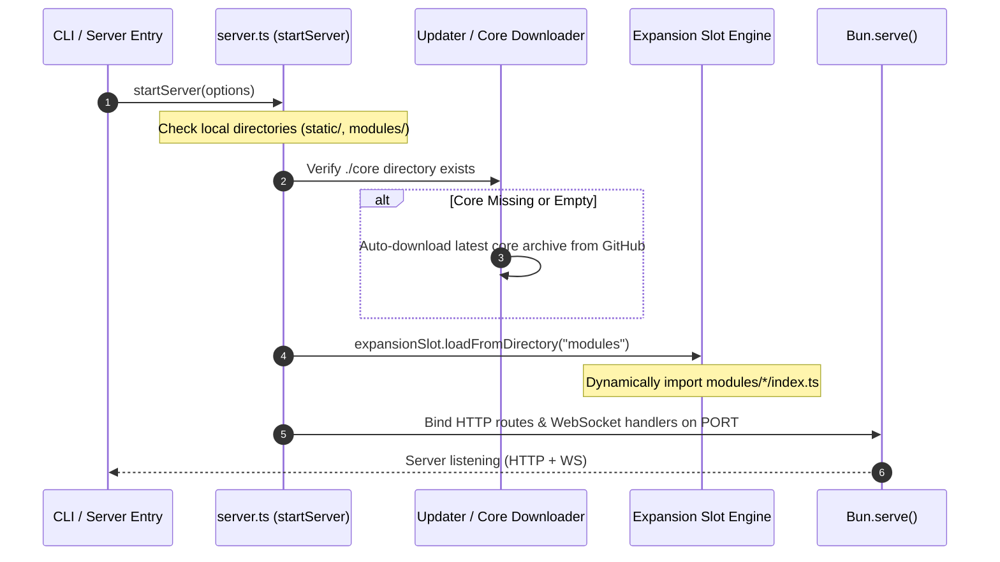

# Architecture & System Design

This document details the architectural design, boot sequence, routing pipeline, and messaging topology of **Stream Overlay Socket**.

---

## 🏛 High-Level Architecture

The system is powered by **Bun** as the JavaScript runtime and **Hono** as the HTTP router, with native high-performance Bun WebSockets for real-time pub/sub delivery.

```mermaid
graph TD
    Client[OBS Overlays / Browser Controller] -->|HTTP / REST| HonoRouter[Hono HTTP Router]
    Client -->|WebSocket| BunWS[Bun Native WebSocket Engine]
    
    subgraph Server Runtime [Bun.serve Engine]
        HonoRouter --> StaticRoutes[Static Delivery (/static, /controller, /core)]
        HonoRouter --> ApiRoutes[API Endpoints (/api/spotify, /api/update)]
        HonoRouter --> ExtRouter[Extension API (/api/extension/<modules>)]
        
        BunWS --> TopicHub[Pub/Sub Topic: dethzon:system]
        BunWS --> SptHandler[Spotify Polling Worker]
        BunWS --> TTHandler[TikTok Live Connector]
        BunWS --> ExtWsHandler[Expansion Modules WS Interceptor]
    end

    ExtRouter --> ModDisk[Local Modules: ./modules]
    StaticRoutes --> StaticDisk[Overlays & Libs: ./static]
    StaticRoutes --> CoreDisk[Socket Core: ./core]
```

---

## 🔄 Boot Sequence (`startServer`)

When `bun run serve` or `bun run dev` runs, the bootstrap lifecycle in [`src/server.ts`](file:///Users/george/repo/dethz-tools/live-tools/stream-overlay-socket/src/server.ts) executes:



---

## 🗺 Route Architecture

| Route Pattern | Target Directory / Handler | Description |
| :--- | :--- | :--- |
| `GET /` | Inline text handler | Server health check indicator (`"server loaded"`). |
| `GET /static` | [`src/routes/staticPage.ts`](file:///Users/george/repo/dethz-tools/live-tools/stream-overlay-socket/src/routes/staticPage.ts) | Dynamic HTML gallery displaying cards for all installed overlays. |
| `GET /static/*` | `./static` | Static file server for overlays, thumbnails, and `static/libs/*`. |
| `GET /controller/*` | `./core/controller` | Dashboard control panel for live stream management. |
| `GET /spotify/*` | `./core/spotify` | Spotify authentication & callback handling pages. |
| `GET /core/*` | `./core` | Shared CSS, fonts, and frontend JavaScript libraries. |
| `ALL /api/spotify/*` | [`src/routes/api/spotify`](file:///Users/george/repo/dethz-tools/live-tools/stream-overlay-socket/src/routes/api/spotify) | Spotify OAuth redirect and token exchange endpoints. |
| `ALL /api/update/*` | [`src/routes/api/update.ts`](file:///Users/george/repo/dethz-tools/live-tools/stream-overlay-socket/src/routes/api/update.ts) | Version inspection and core update downloader endpoints. |
| `ALL /api/extension/*` | [`src/routes/api/extension.ts`](file:///Users/george/repo/dethz-tools/live-tools/stream-overlay-socket/src/routes/api/extension.ts) | Master extension slot router dispatching to installed `./modules`. |
| `ALL /api/modules/*` | [`src/routes/api/extension.ts`](file:///Users/george/repo/dethz-tools/live-tools/stream-overlay-socket/src/routes/api/extension.ts) | Backward-compatible alias for `/api/extension`. |
| `WS /ws` | [`src/routes/ws/index.ts`](file:///Users/george/repo/dethz-tools/live-tools/stream-overlay-socket/src/routes/ws/index.ts) | WebSocket pub/sub connection endpoint. |

---

## 📡 Real-Time Pub/Sub Message Bus

WebSocket clients subscribe to the `dethzon:system` topic on connection:

1. **Incoming Messages (`onMessage`)**:
   - If the message starts with `spt: `, it is routed to the Spotify worker.
   - If the message starts with `tt: `, it is routed to the TikTok Live connector.
   - If an expansion module matched on `wsPrefix` consumes the message, `onWsMessage` runs.
   - Any message not consumed by built-in or extension handlers is broadcast to all clients subscribed to `dethzon:system`.

2. **Broadcast Delivery**:
   - `rawWS.publish("dethzon:system", message)` broadcasts without echoing back to the sender.
   - `context.broadcast(message)` inside extension modules broadcasts to every active connection on the system topic.

---

## 🛡 Fault Tolerance & Auto-Recovery

- **Automatic Core Recovery**: If `./core` is missing or corrupted, the server automatically pulls and extracts the latest release archive from GitHub during startup.
- **Graceful WebSocket Teardown**: Client disconnects trigger cleanup handlers in the Spotify polling loop, preventing zombie timers or token leakages.
- **Module Sandboxing**: Failure within an individual expansion module router or lifecycle method is caught and logged, preventing the main process from crashing.
